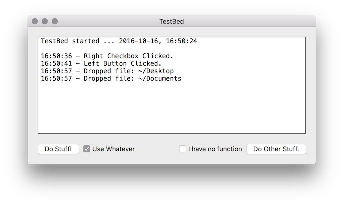

Ever wanted a nice macOS ObjC UI project skeleton for a quick prototype? Well, here it is:

# Features

- LogView
- Buttons
- Checkboxes
- Drag & Drop Support

# Attributions

App Icons by [Zlatko Najdenovski](https://www.iconfinder.com/zlaten) & [Tom jones](https://www.iconfinder.com/tommjones) ; licensed under [CC BY 3.0](https://creativecommons.org/licenses/by/3.0/legalcode) ; SVG -> appiconset conversion by me ; commit: 9acbf7e9db747253e906c53d4d1790fb698a55da
